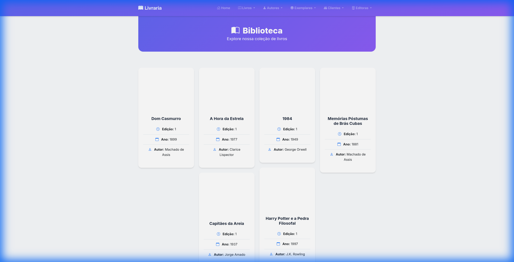
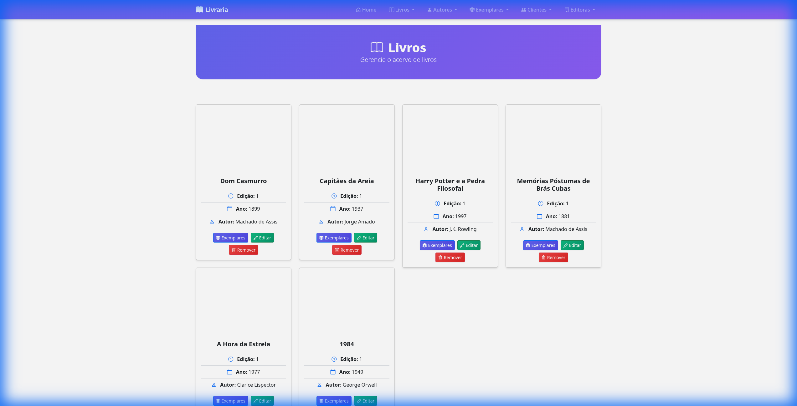
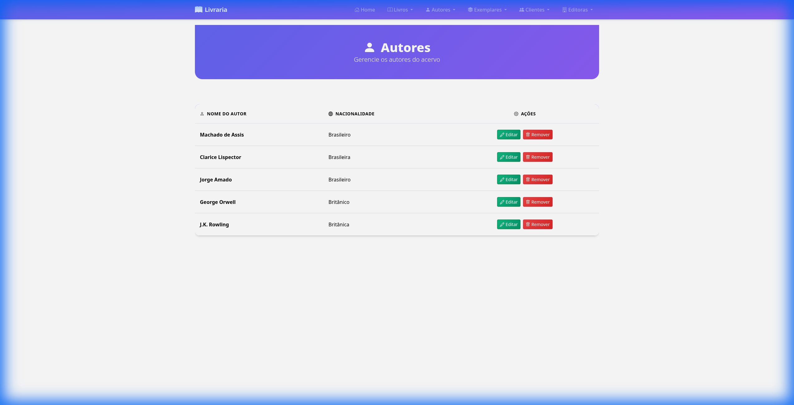
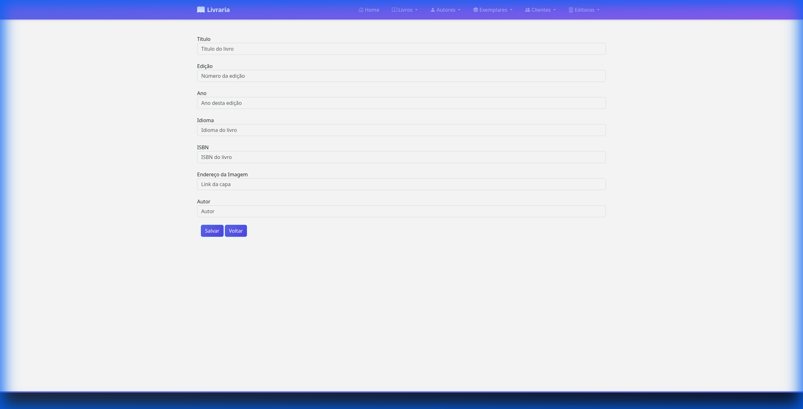
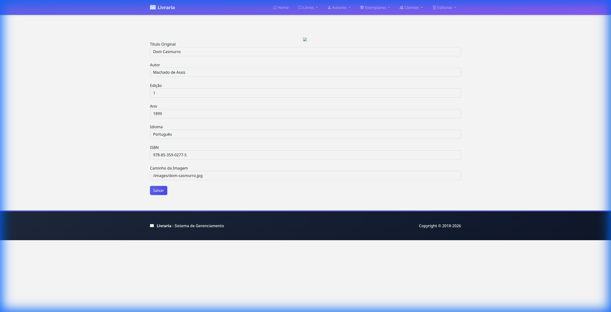
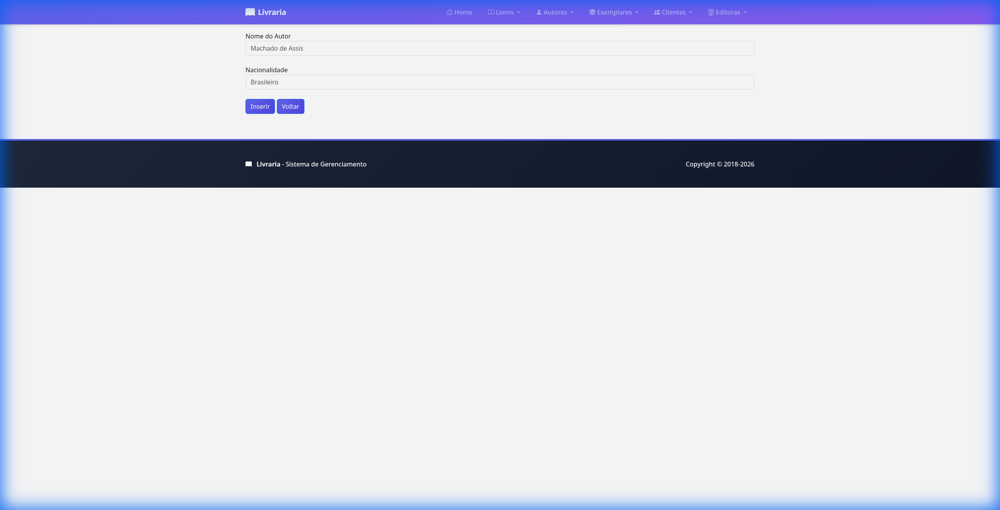
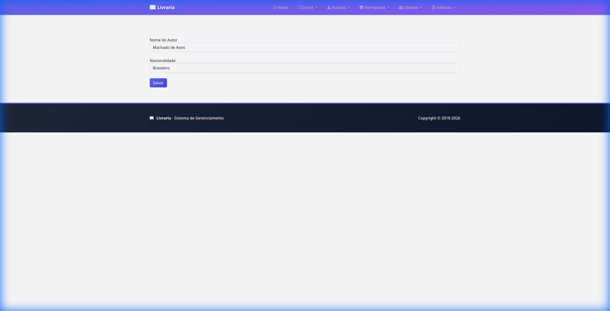

# livraria

projeto programacao-web ufabc 2018-2Q

Sistema de gerenciamento de biblioteca desenvolvido com Spring Boot, JPA e PostgreSQL.

## 🎨 Interface Moderna

O projeto possui uma interface moderna e responsiva com:

- **Design atualizado** com Bootstrap 5 e ícones Bootstrap Icons
- **Gradientes e sombras** para um visual mais profissional
- **Animações suaves** e transições
- **Cards modernos** com efeitos hover
- **Tabelas estilizadas** com cores gradientes
- **Tipografia melhorada** com fonte Inter
- **Totalmente responsivo** para todos os dispositivos

## 📋 Pré-requisitos

Antes de começar, certifique-se de ter instalado:

- **Java 21** ou superior
- **Gradle** (ou use o Gradle Wrapper incluído no projeto)
- **Docker** e **Docker Compose** (para desenvolvimento automático)

## 🚀 Configuração e Instalação

### Modo de Desenvolvimento (Recomendado) 🎯

O projeto usa **Spring Boot Dev Services** que automaticamente inicia um **PostgreSQL em container Docker** durante o desenvolvimento!

**Não é necessário configurar PostgreSQL manualmente** - tudo é feito automaticamente:

- ✅ PostgreSQL iniciado automaticamente via Docker Compose
- ✅ Banco de dados criado automaticamente
- ✅ Configuração de conexão feita automaticamente
- ✅ Reinício automático com Spring DevTools
- ✅ LiveReload habilitado
- ✅ Container é parado automaticamente quando a aplicação é encerrada

**Como funciona:**

- O Spring Boot detecta o arquivo `docker-compose.yml` na raiz do projeto
- Inicia automaticamente o container PostgreSQL quando você roda a aplicação
- Configura a conexão JDBC automaticamente
- Para o container quando você para a aplicação

**Requisito:** Docker e Docker Compose devem estar instalados e rodando.

## ▶️ Como Executar o Projeto

### Opção 1: Usando Gradle Wrapper (Recomendado)

No Linux/Mac:

```bash
./gradlew bootRun
```

No Windows:

```bash
gradlew.bat bootRun
```

### Opção 2: Compilar e Executar

1. Compile o projeto:

   ```bash
   ./gradlew build
   ```

2. Execute o JAR gerado:
   ```bash
   java -jar build/libs/livraria-0.0.1-SNAPSHOT.jar
   ```

### Opção 3: Usando IDE

1. Importe o projeto no seu IDE (IntelliJ IDEA, Eclipse, VS Code)
2. Execute a classe `LivrariaApplication.java`

## 🌐 Acessar a Aplicação

Após iniciar a aplicação, acesse:

- **Aplicação:** http://localhost:8080

A aplicação estará rodando na porta 8080 (padrão do Spring Boot).

### Spring Boot Dev Services

O projeto usa **Spring Boot Dev Services** que oferece:

- 🐳 **PostgreSQL Automático:** Inicia e para containers Docker automaticamente
- 🔄 **Auto-restart:** Reinicia automaticamente quando você salva arquivos (via DevTools)
- 🔥 **LiveReload:** Recarrega o navegador automaticamente (requer extensão do navegador)
- 🛠️ **Desenvolvimento otimizado:** Desabilita cache de templates em desenvolvimento
- 📦 **Zero Config:** Não precisa configurar datasource manualmente

**Referência:** [Spring Boot Dev Services Documentation](https://docs.spring.io/spring-boot/reference/features/dev-services.html)

## 📊 Dados Iniciais (Seed Data)

O projeto inclui um sistema de seed data que popula automaticamente o banco de dados com dados de exemplo na primeira execução.

**Importante:**

- Os dados são criados apenas se o banco estiver vazio (verifica se já existem autores)
- Com Spring Boot Dev Services: O container PostgreSQL é recriado a cada execução, então os dados serão populados novamente

- **5 Autores** (Machado de Assis, Clarice Lispector, Jorge Amado, George Orwell, J.K. Rowling)
- **4 Editoras** (Companhia das Letras, Editora Globo, Rocco, Penguin Books)
- **6 Livros** com informações completas
- **16 Exemplares** distribuídos entre os livros
- **4 Clientes** com dados de exemplo
- **3 Empréstimos** ativos

## 🧪 Como Testar o Projeto

### Executar Testes Unitários

```bash
./gradlew test
```

### Testar Manualmente

1. **Acesse a página inicial:**
   - Navegue para http://localhost:8080
   - Verifique se a página carrega corretamente

2. **Teste as funcionalidades:**
   - **Autores:** Visualize, adicione, edite e remova autores
   - **Editoras:** Gerencie editoras do sistema
   - **Livros:** Adicione livros associados a autores e editoras
   - **Exemplares:** Gerencie cópias dos livros
   - **Clientes:** Cadastre e gerencie clientes
   - **Empréstimos:** Realize empréstimos de exemplares para clientes

3. **Verifique os dados iniciais:**
   - Após a primeira execução, verifique se os dados de seed foram criados
   - Navegue pelas páginas de listagem para confirmar

### Verificar Logs

Durante a execução, você verá mensagens no console indicando:

- Se o seed data foi executado ou pulado
- Quantidade de registros criados em cada entidade

Exemplo de saída:

```
Seeding database with initial data...
Seed data created successfully!
- Authors: 5
- Publishers: 4
- Books: 6
- Book Copies: 16
- Clients: 4
- Loans: 3
```

## 🛠️ Estrutura do Projeto

```
src/main/java/com/ufabc/web/livraria/
├── config/
│   └── DataSeeder.java          # Classe responsável pelo seed data
├── controller/                   # Controladores REST/Web
├── model/
│   ├── dao/                      # Repositórios JPA
│   ├── entity/                   # Entidades JPA
│   └── service/                  # Camada de serviços
└── LivrariaApplication.java     # Classe principal

src/main/resources/
└── application.properties        # Configurações da aplicação

src/main/webapp/
└── WEB-INF/                      # Páginas JSP
```

## 📝 Notas Adicionais

- O projeto usa **Hibernate** com `ddl-auto=update`, então as tabelas são criadas/atualizadas automaticamente
- As imagens de capa dos livros são referenciadas por caminho (`srcImagemCapa`), certifique-se de ter os arquivos correspondentes se necessário
- O projeto utiliza **JSP** para as views

## 🐛 Solução de Problemas

### Docker não está rodando

- Verifique se o Docker está instalado: `docker --version`
- Verifique se o Docker está rodando: `docker ps`
- Inicie o Docker se necessário

### Erro ao iniciar container PostgreSQL

- Verifique se a porta 5432 não está em uso: `lsof -i :5432` (Linux/Mac) ou `netstat -ano | findstr :5432` (Windows)
- Se necessário, pare outros containers PostgreSQL: `docker ps` e `docker stop <container_id>`
- O Spring Boot Dev Services gerencia isso automaticamente, mas conflitos podem ocorrer

### Erro de conexão com o banco de dados

- Verifique se o Docker está rodando
- O Spring Boot Dev Services gerencia tudo automaticamente
- Se necessário, pare containers antigos: `docker ps` e `docker stop <container_id>`

### Problemas com Spring DevTools

- Se o auto-restart não funcionar, verifique se está usando `developmentOnly`
- Reinicie manualmente se necessário
- Em Gradle, se usar `bootTestRun`, considere mudar para `testAndDevelopmentOnly` conforme [documentação](https://docs.spring.io/spring-boot/reference/features/dev-services.html)

### Porta 8080 já em uso

- Altere a porta em `application.properties` adicionando: `server.port=8081`

### Erro ao compilar

- Verifique se o Java 21 está instalado: `java -version`
- Limpe e recompile: `./gradlew clean build`

---

## 📸 Screenshots

Aqui estão as capturas de tela da interface modernizada:

### Página Inicial

Interface principal com cards modernos exibindo os livros do acervo.


### Página de Livros

Listagem completa de livros com ações de gerenciamento.


### Página de Autores

Tabela estilizada com informações dos autores e ações rápidas.


### Páginas de Inserção e Edição

Formulários modernos para cadastro e edição de entidades.

#### Inserir Livro



#### Editar Livro



#### Inserir Autor



#### Editar Autor


